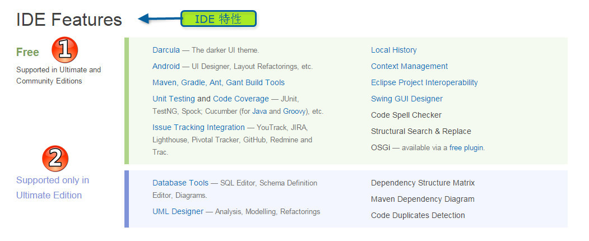
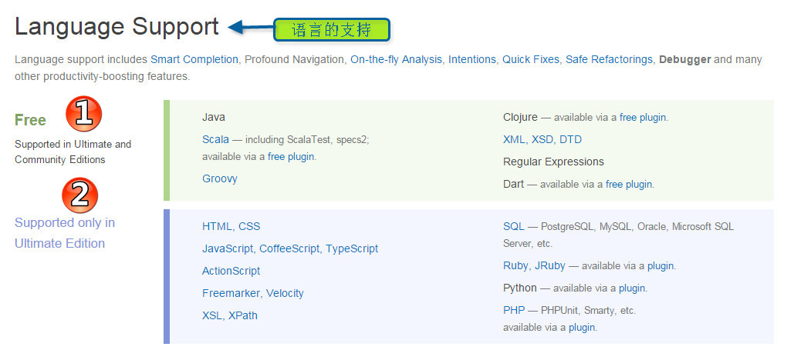
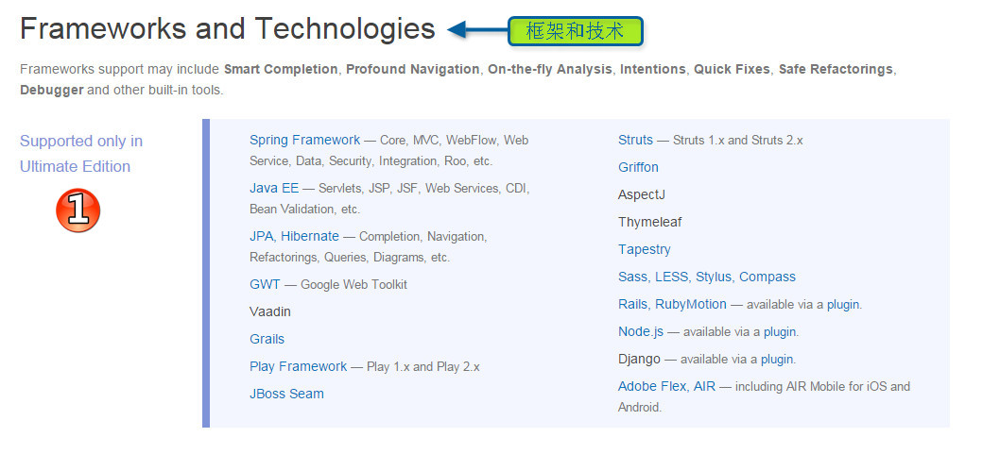
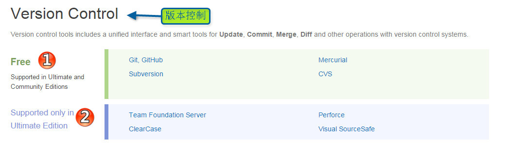

## Intellij IDEA 编辑器比较 （Intellij IDEA Editions Comparison）

### 旗舰版和社区版简要差别说明
> *  旗舰版英文名：Intellij IDEA Ultimate
> *  社区版英文名：Intellij IDEA Community
> *  旗舰版包括社区版的所有功能，而社区版只有旗舰版的大部分功能（简单的可以理解为社区版是缺失旗舰版上部分功能模块的版本）。旗舰版是收费的，社区版是免费的。
> *  旗舰版功能强大，对HTML,CSS,JavaScript 支持的非常好，也可以通过安装插件来对其他类的语言的支持，比如想要支持php 语言,可以安装php插件，比如想要支持Python 语言,可以安装Python插件等。
> *  官方英文对比说明:<https://www.jetbrains.com/idea/features/editions_comparison_matrix.html>

### 模块对比说明

> *  图标1：社区版，旗舰版共同拥有的功能
> *  图标2：只有旗舰版才有拥有的功能，但是社区版没有的功能

> *  图标1：社区版，旗舰版共同拥有的功能
> *  图标2：只有旗舰版才有拥有的功能，但是社区版没有的功能

> *  图标1：只有旗舰版才有拥有的功能，但是社区版没有的功能

> *  图标1：只有旗舰版才有拥有的功能，但是社区版没有的功能

> *  图标1：社区版，旗舰版共同拥有的功能
> *  图标2：只有旗舰版才有拥有的功能，但是社区版没有的功能

> *  图标1：社区版，旗舰版共同拥有的功能
> *  图标2：只有旗舰版才有拥有的功能，但是社区版没有的功能
