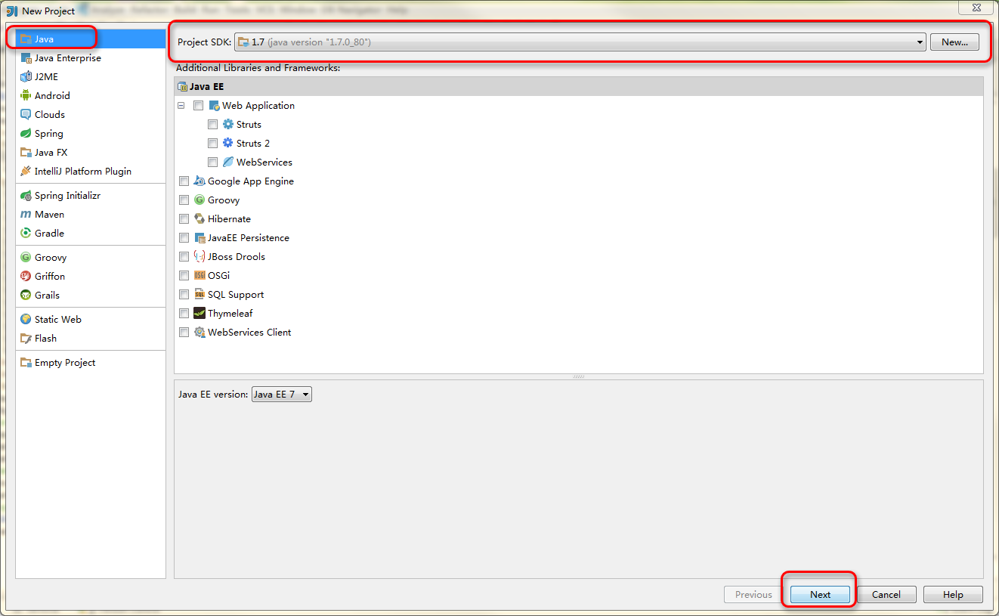
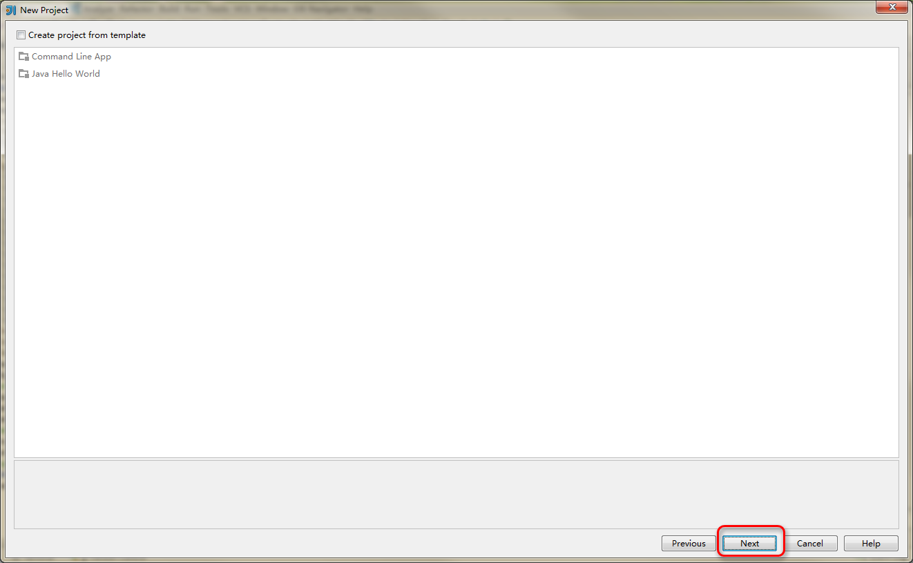
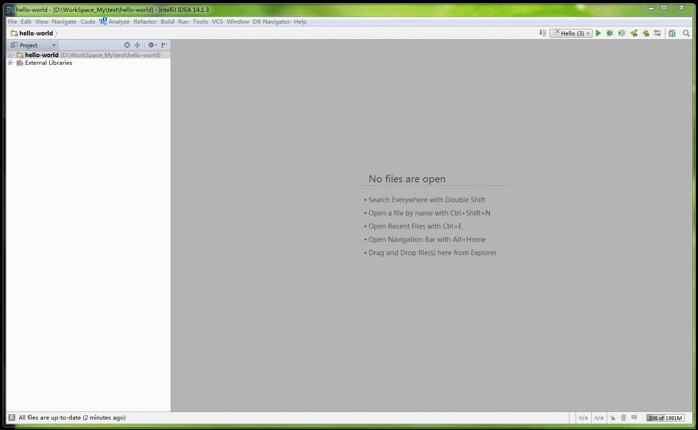
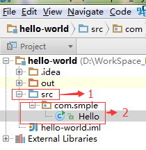
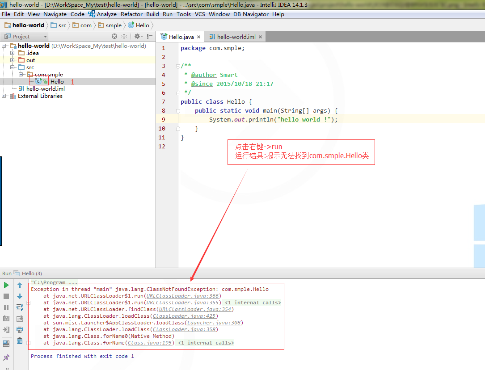
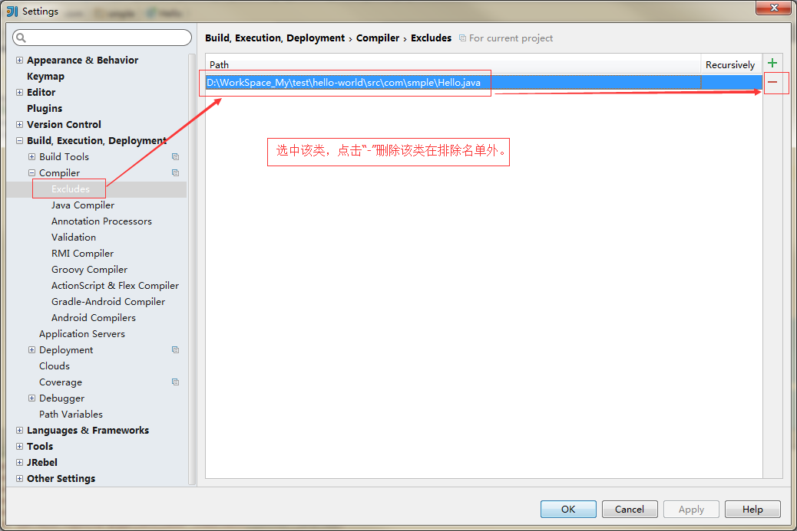
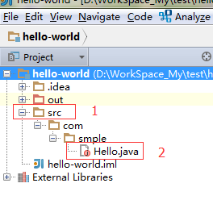
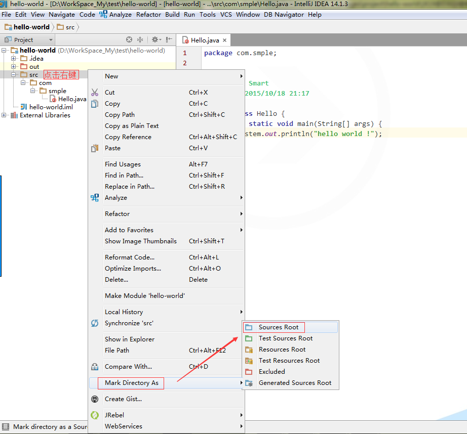

# 初恋（Hello world）

#### Intellij  IDEA  欢迎界面

> * 如果你启动Intellij IDEA，进入的画面如上图, 点击`Create New Project`。
> * 如果你启动Intellij IDEA，直接进入Intellij IDEA的里面：点击`File`->`New`->`Project`.

#### 项目配置界面

> * 选择`java`
> * 选择 JDK 版本：在`Project SDK` 中选择对应的JDK,如上图，选择了 JDK 1.7
> * 然后直接 下一步 next

#### 模板的选择

> * 建议第一次创建不要选择模板，熟悉一下整体的流程，直接下一步 next.

#### 项目名和项目路径的设置

> * 配置好项目名和项目路径后，直接点Fish.

#### 创建package和创建class,运行程序整个过程

#### 正确的项目目录结构示意图

### 不要高兴的太早，你踩到坑了吗？

#### 小坑代号1：

>* 请认真看上图标号1中的图标跟正确的项目上的图标不一样。这个图标代表此类不会被编译。排除在编译之处。解决办法入下图所示

#### 小坑代号2：

>* 主类无法运行，但是不报错，没有任何提示，而且在类里面点击右键没有`run` 按钮出现。原因是文件`src`目录没有指定成`Sources Root`.解决办法如下图

