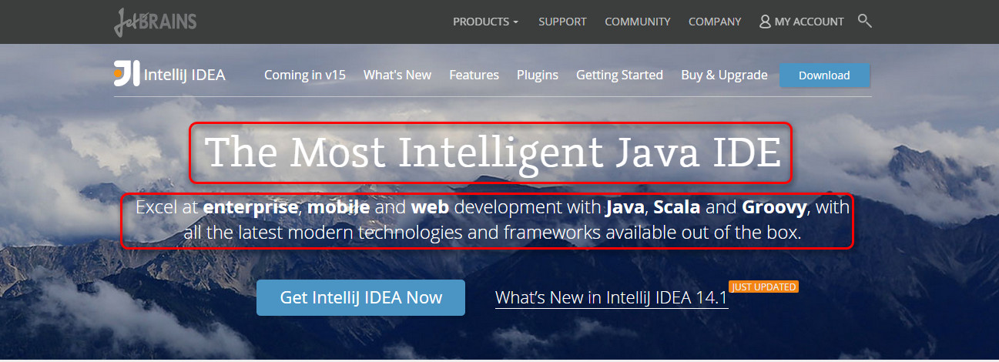
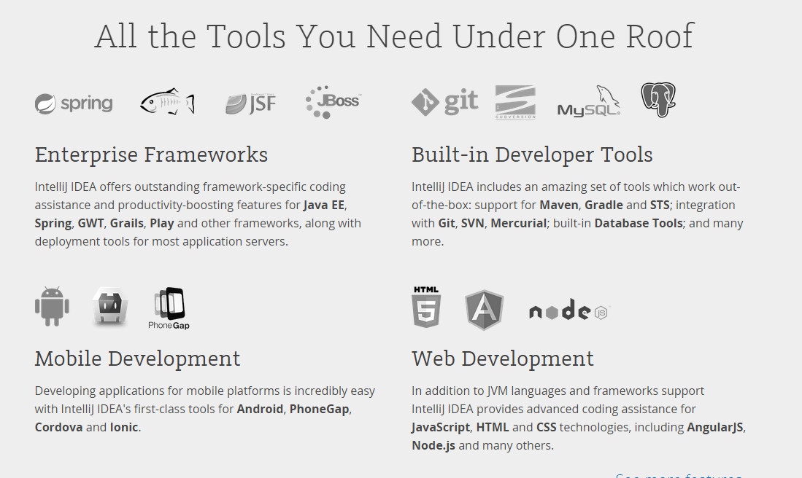
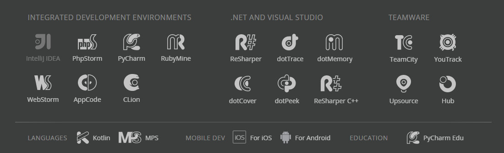

# 介绍

## IntelliJ IDEA 介绍

> ##### IntelliJ IDEA 官网：<https://www.jetbrains.com/idea/>
> 

> ##### IntelliJ IDEA 的口号：
> The Most Intelligent Java IDE
简明翻译：最好，最智能的java 开发 IDE

> ##### IntelliJ IDEA 在官网主页是这样评价自己的：
> Excel at enterprise, mobile and web development with Java, Scala and Groovy, with all the latest modern technologies and frameworks available out of the box.
简明翻译： 擅长企业、移动和Java web开发,Scala和Groovy,所有最新的现代技术和框架提供开箱即用的。
> Intellij IDEA 打出这样霸气的口号，和这么高的评价自己的产品，那是有好的产品的实力作为基础的，绝对不是吹牛。
如果让我用一句话来评价 Intellij IDEA 的话，我会这么说：Intellij IEA 是 一个有灵性，非常人性化的IDE,你懂它，明白它，它会给你带来你想不到的便捷。反之，你会被它玩的很痛苦。

> ##### IntelliJ IDEA 支持的功能简图

> 

## JetBrains 公司下的产品简介

> #####  产品分布图
>  

> #####  其中部分产品的说明

|产品       | 支持的语言   |
| --------   | -----:  |
| | (旗舰版，功能齐全)主要用于开发 java, Groovy, Scala,Android，JavaScript, Node.js, HTML and CSS 等 |
| | (社区版，功能不全)主要用于开发 java, Groovy, Scala and Android,JavaScript, Node.js, HTML and CSS 等|
| | 主要用于开发  JavaScript, Node.js, HTML and CSS等 |
| | 主要用于开发 Python, JavaScript, CoffeeScript, TypeScript, CSS|
| | 主要用于开发 HTML, JavaScript, CSS, Sass, Less, CoffeeScript等  |
| | 主要用于开发 Ruby and Rails, JavaScript and CoffeeScript, ERB and HAML, CSS, Sass and Less等 |
| | 主要用于开发 Objective-C, Swift, C, or C++  |
| | 主要用于开发 C and C++ |
| | 主要用于开发 C#, VB.NET, ASP.NET, ASP.NET MVC, XAML, XML, HTML, JavaScript, or CSS  |
| | 主要用于开发 C++  |

> ##### 更多关于旗舰版和社区版差异细节
> * [旗舰版和社区版的功能比较](IntelliJ-IDEA-Editions-Comparison.md)

> #####  更多产品信息

> * 产品大全：<https://www.jetbrains.com/products.html?fromMenu>

## 更多官网信息
> * IntelliJ IDEA 官网：<https://www.jetbrains.com/idea/>
> * 官网博客：<http://blog.jetbrains.com/idea/>
> * IntelliJ IDEA 主要特性介绍：<https://www.jetbrains.com/idea/features/>
> * IntelliJ IDEA 在旗舰版和社区版区别详情：<https://www.jetbrains.com/idea/features/editions_comparison_matrix.html>
> * 官网在线帮助文档（重点看）：<http://www.jetbrains.com/idea/webhelp/getting-help.html>
> * 官网社区：<http://devnet.jetbrains.com/community/idea>

## 更多官方视频 （需要翻墙）
> *  Intellij IDEA 快速入门（重点看）：<https://www.jetbrains.com/idea/documentation/>
> * Intellij IDEA 教程视频专辑（重点看） ：<https://www.youtube.com/playlist?list=PLPZy-hmwOdEXdOtXdFzyx_XCnrF_oD2Ft>
> * Intellij IDEA 14 新功能 视频专辑 ：<https://www.youtube.com/playlist?list=PLPZy-hmwOdEXzae0zXhrSxydfB-tN0ngi>
> * Intellij IDEA 14.1新功能 视频专辑 ：<https://www.youtube.com/playlist?list=PLPZy-hmwOdEW8sxFp7fIIOzfqvo5YwMv0>

